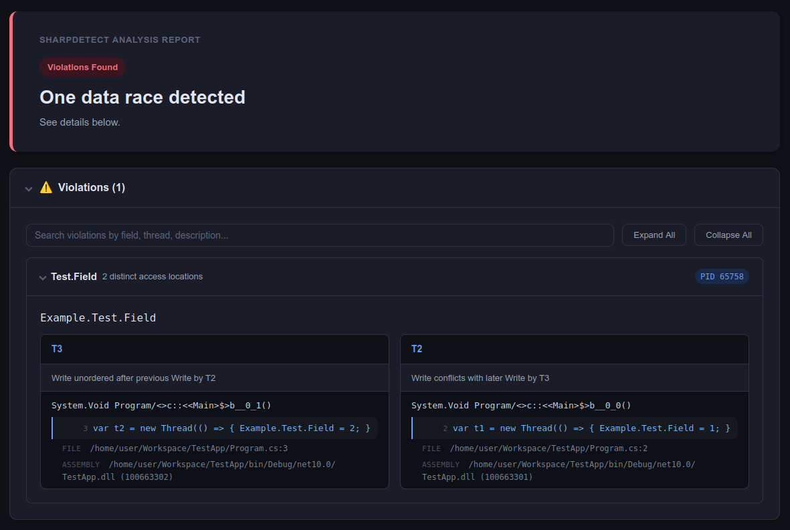

# SharpDetect

[](https://github.com/acizmarik/sharpdetect/blob/main/LICENSE)
[](https://github.com/acizmarik/sharpdetect/actions)
[](https://www.nuget.org/packages/SharpDetect)
[](https://www.nuget.org/packages/SharpDetect)

## Overview

SharpDetect is a dynamic analysis tool for .NET applications that detects concurrency issues such as data races and deadlocks.
It attaches a native CoreCLR profiler to the target process and routes runtime events through analysis plugins.

## Installation

SharpDetect is distributed as a .NET Tool on [NuGet](https://www.nuget.org/packages/SharpDetect):

```bash
dotnet tool install --global SharpDetect # Latest stable release
dotnet tool install --global SharpDetect --prerelease # Latest preview
```

## Quick Start

### 1. Create a Program to Analyze

Create and build a new console .NET application with the following code:

```csharp
// Two threads write to a shared field with no synchronization — a data race.
var t1 = new Thread(() => { Example.Test.Field = 1; });
var t2 = new Thread(() => { Example.Test.Field = 2; });

t1.Start();
t2.Start();
t1.Join();
t2.Join();

namespace Example
{
    static class Test { public static int Field; }
}
```

### 2. Run Analysis

Use the `sharpdetect run` command to run the analysis:

```bash
sharpdetect run \
  --target "bin/Debug/net10.0/TestApp.dll" \
  --plugin "FastTrack"
```

The command above launches target application, attaches profiler and configures analysis pipeline with the FastTrack plugin for data race detection.

### 3. View the Report

When a data race is detected, a log message is emitted:

```text
warn: SharpDetect.Plugins.DataRace.FastTrack.FastTrackPlugin[0]
      [PID=65758] Data race on static field Example.Test.Field
          Current write by thread T3:
              at Program/<>c.<<Main>$>b__0_1:IL_0002
          Previous write by thread T2:
              at Program/<>c.<<Main>$>b__0_0:IL_0002
```

When the target application terminates, the path to the generated report is printed:

```text
Report stored to file: /home/user/Workspace/SharpDetect_Report_20251223_095828.html.
```



Reports are self-contained HTML files. Each report includes:
- The affected field
- The participating threads
- Stack frames at the point of the conflicting accesses (a single frame by default, or a multi-frame stack trace when [stack-trace collection](docs/guides/running-analysis-with-configuration-file.md#data-race-plugin-options) is enabled)

## Documentation

More details for running and configuring analysis is described in `docs` folder.
- [Running analysis against regular .NET assembly](docs/guides/running-analysis-against-executables.md)
- [Running analysis against .NET test assembly](docs/guides/running-analysis-against-tests.md)
- [Advanced analysis configuration](docs/guides/running-analysis-with-configuration-file.md)

## Analysis Plugins

### Data Race Detection — FastTrack

The `FastTrack` plugin detects data races using the FastTrack algorithm (Flanagan & Freund, 2009).

#### Supported Synchronization Primitives
- `System.Threading.Monitor`
- `System.Threading.Lock`
- `System.Threading.SemaphoreSlim`
- `System.Threading.Mutex` (unnamed)
- `System.Threading.Semaphore` (unnamed)
- `System.Threading.EventWaitHandle` (`AutoResetEvent`, `ManualResetEvent`)
- `System.Threading.Volatile` (including `volatile` field modifier)

#### Supported Threading Primitives
- `System.Threading.Thread`
- `System.Threading.Tasks.Task`

#### Supported Memory Accesses
- Static fields (`LDSFLD`, `STSFLD`)
- Instance fields (`LDFLD`, `STFLD`)

#### Configuration

To customize instrumentation scope, generate an analysis configuration file:

```bash
sharpdetect init \
  --plugin "FastTrack" \
  --target "<path/to/YourExecutableDotNetAssembly.dll>" \
  --output "AnalysisConfiguration.json"
```

### Deadlock Detection

The `Deadlock` plugin detects deadlocks by tracking lock acquisition order across threads and identifying circular wait conditions.

#### Supported Synchronization Primitives
- `System.Threading.Monitor`
- `System.Threading.Lock`

#### Supported Threading Primitives
- `System.Threading.Thread`

#### Configuration

To customize instrumentation scope, generate an analysis configuration file:

```bash
sharpdetect init \
  --plugin "Deadlock" \
  --target "<path/to/YourExecutableDotNetAssembly.dll>" \
  --output "AnalysisConfiguration.json"
```

## Limitations / Known Issues

### Data Race Detection

- **False positives**:
   - Memory accesses guarded by unsupported synchronization primitives may report data races.
- **False negatives**: 
   - Array element accesses are not analyzed.
   - Heuristics for determining object publication is responsible for missing some data races.
- **Performance overhead**:
   - Every analyzed memory access needs to be instrumented and emits runtime event.
   - Every analyzed synchronization operation (acquire, release, ...) emits runtime event.
   - Every thread lifecycle action (start, join, ...) emits runtime event.
   - Every task lifecycle action (schedule, start, ...) emits runtime event.
   - Programs that heavily utilize operations above will observe significant slowdowns.

### Deadlock Detection

- **False negatives**:
   - Deadlocks involving unsupported synchronization primitives will not be detected.
- **Performance**: 
   - Every analyzed synchronization operation (acquire, release, ...) emits runtime event.
   - Every thread lifecycle action (start, join, ...) emits runtime event.
   - Programs that heavily utilize operations above will observe significant slowdowns.

## Building from Source

### Prerequisites

- .NET 10 SDK
- C++20 compiler with CMake
- Platform-specific dependencies for [Native AOT deployment](https://learn.microsoft.com/en-us/dotnet/core/deploying/native-aot)

### Build Instructions

```bash
git clone https://github.com/acizmarik/sharpdetect.git
cd sharpdetect
git submodule update --init --recursive

cd src
dotnet cake.cs
```

## Platform Support

SharpDetect supports analysis of programs targeting .NET 8, 9, and 10.
Supported operating systems are Windows and Linux. Supported architecture is x64.

## Acknowledgments

SharpDetect is built with the help of numerous open-source libraries and components.
For detailed licensing information and full copyright notices, please see [THIRD-PARTY-NOTICES.md](THIRD-PARTY-NOTICES.md).

## License

This project is licensed under the [Apache-2.0 license](LICENSE).
